# **UAP Administrasi Sistem Berbasis Portfolio**
**Oleh Ghifari Adil Ruchiyat - 215150701111003**

1. Untuk membuat file menggunakan perintah

   `$ touch UAP-Adsis/catatannya-adil.txt`

   sehingga akan muncul folder baru dengan file txt didalamnya, seperti berikut:
   
   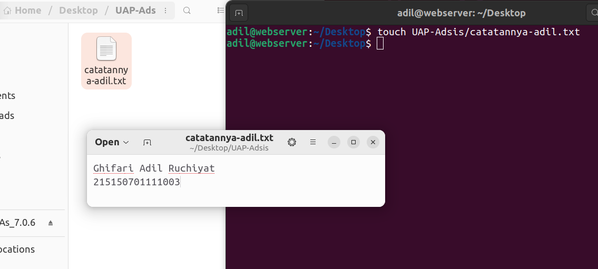

   Kemudian kita akan mengubah izin akses file txt tersebut agar user biasa hanya bisa membacanya, dengan menggunakan perintah

   `$ chmod o=r catatannya-adil.txt`

   Perintah diatas digunakan untuk mengubah izin file tersebut agar hanya bisa dibaca (read) oleh other user. Hasilnya dapat dilihat dengan perintah ls, seperti berikut:

   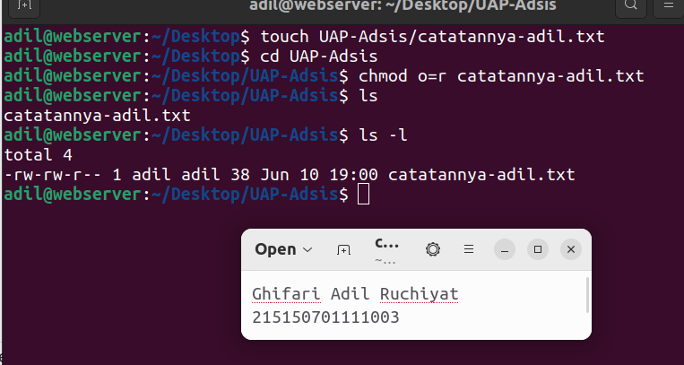

2. Untuk melakukan konfigurasi alamat IP sementara dan default gatewaynya, digunakan perintah berikut:
   
   `$ sudo ifconfig [nama interface] 192.168.56.7
   $ sudo route add default gw 192.168.56.7 [nama interface]`

   Sehingga hasilnya adalah sebagai berikut:

   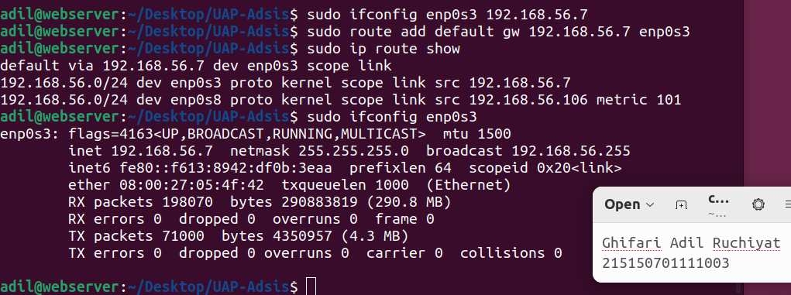

3. Pembuatan user baru pada webmin dilakukan pada tab System > Users and Groups > Local User, dan menekan pada tombol New User. Jika sudah, maka akan tampil seperti berikut:
   
   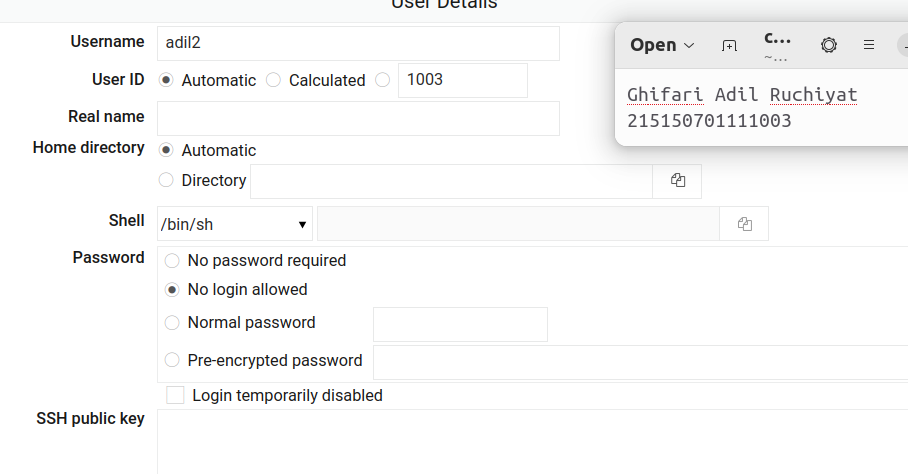

   Karena user bernama adil sudah dibuat, maka akan dibuat user baru dengan nama adil2.
   
   Jika sudah selesai dibuat, maka akan muncul pada daftar user di webmin, seperti berikut:

   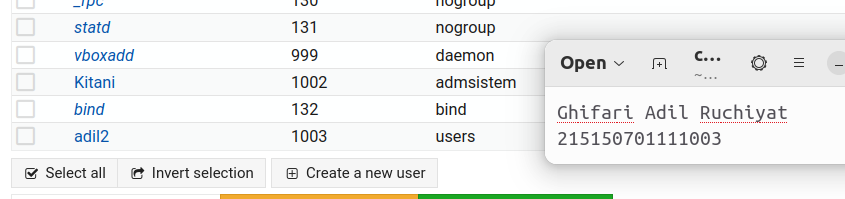

   Kemudian akan dibuat group baru yang bernama Adsis_E. Untuk emembuat group baru terletak pada tab Local Group dan menekan tombol new Group, seperti berikut:

   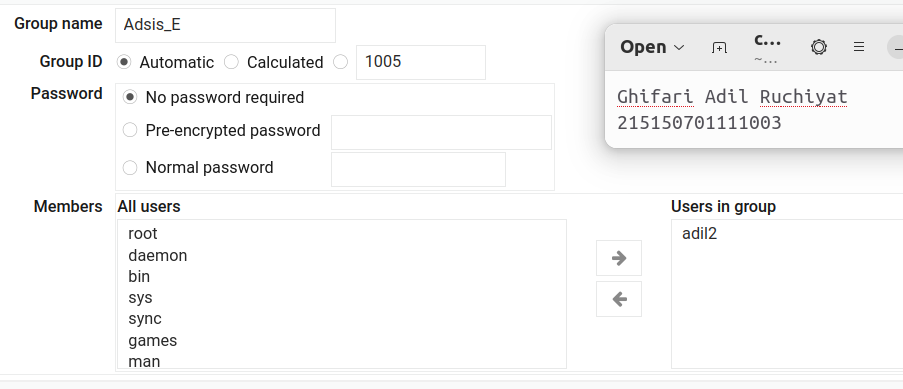

   Untuk menambahkan user adil2 ke dalam group, cukup dengan menekan nama user pada bagian members. Jika sudah, maka group baru akan muncul pada daftar di webmin dan akan terlihat bahwa user adil2 berada pada group tersebut.

   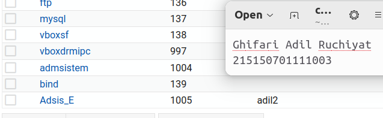

4. Reject atau drop paket pada webmin dilakukan dengan firewall, yang terdapat pada tab Networking > Linux Firewall. Lalu kita akan menambahkan rule pada tabel INPUT.

   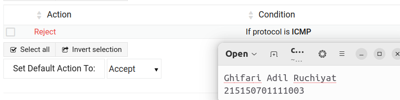

   Rule yang ditambahkan adalah rejecy jika protokol yang masuk adalah ICMP - protokol yang digunakan untuk ping.

   Jika kita melakukan ping pada alamat IP sistem, maka ping akan gagal.

   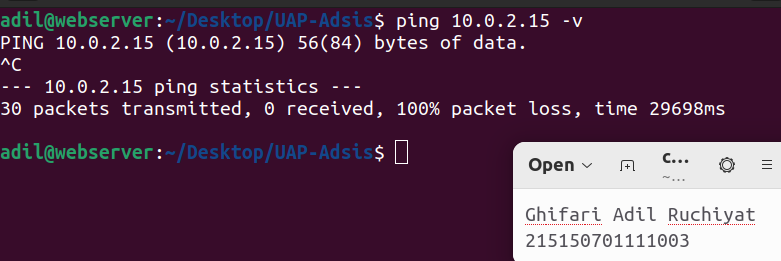

   Pada gambar diatas, tidak ada paket balasan saat melakukan ping, ditandai dengan 100% packet loss. Hal ini terjadi karena paket di reject oleh sistem. Hal yang sama akan terjadi untuk aturan drop ketimbang reject.

5. Pertama-tama akan dibuat file shell script bernama pingFilkom.sh dengan perintah
   
   `$ touch pingFilkom.sh`

   Agar file bisa dieksekusi, maka hak aksesnya diubah dulu dengan perintah

   `$ chmod 777 pingFilkom.sh`

   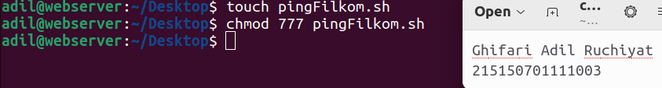

   Isi dari file tersebut adalah sebagai berikut:

   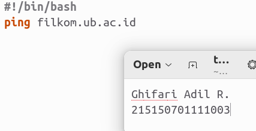

\~\*\~\*\~